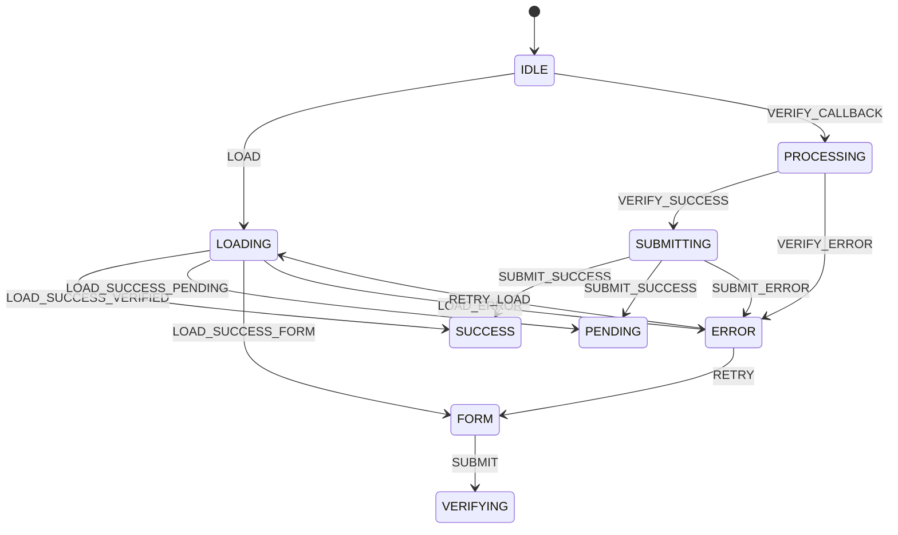
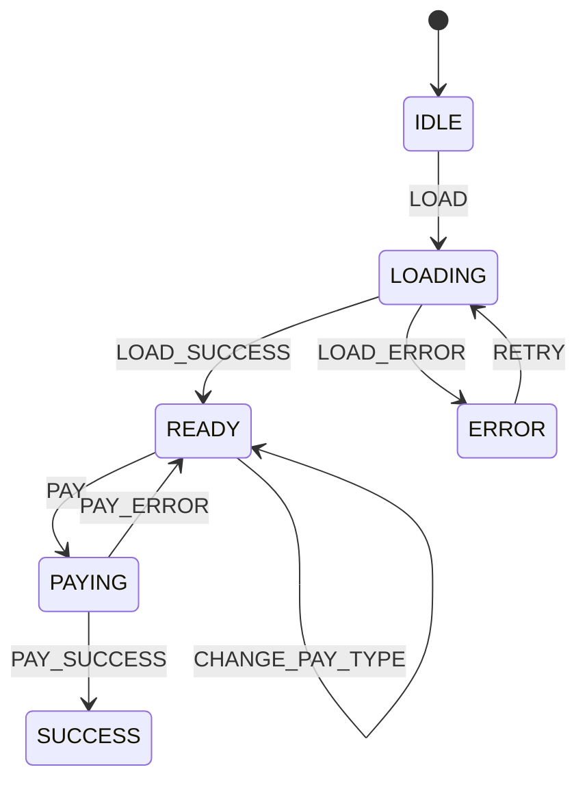
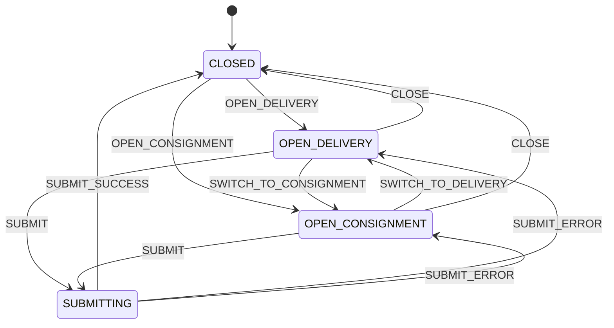

# 状态机使用指南

> **版本**: 1.0.0  
> **创建时间**: 2026-01-14  
> **作者**: 树交所前端团队

---

## 📖 概述

本项目使用状态机模式管理复杂的UI状态，解决多Boolean状态混乱问题。

### 核心优势

✅ **状态互斥性**: 确保同一时间只有一个状态活跃  
✅ **可预测性**: 所有状态转换显式声明  
✅ **可维护性**: 状态逻辑集中管理  
✅ **可测试性**: 状态转换易于单元测试  
✅ **可调试性**: 内置状态转换历史记录

---

## 🏗️ 架构

```
types/states.ts           # 状态和事件枚举定义
hooks/useStateMachine.ts  # 通用状态机Hook
hooks/use[Feature].ts     # 业务状态机Hook（如useCashier）
pages/[Feature].tsx       # 使用状态机的页面组件
```

---

## 🚀 快速开始

### 1. 定义状态和事件

```typescript
// types/states.ts
export enum MyFeatureState {
  IDLE = 'idle',
  LOADING = 'loading',
  SUCCESS = 'success',
  ERROR = 'error',
}

export enum MyFeatureEvent {
  LOAD = 'LOAD',
  SUCCESS = 'SUCCESS',
  ERROR = 'ERROR',
  RETRY = 'RETRY',
}
```

### 2. 创建业务Hook

```typescript
// hooks/useMyFeature.ts
import { useStateMachine } from './useStateMachine';
import { MyFeatureState, MyFeatureEvent } from '../types/states';

interface MyFeatureContext {
  data: any | null;
  error: string | null;
}

const TRANSITIONS: Record<MyFeatureState, Partial<Record<MyFeatureEvent, MyFeatureState>>> = {
  [MyFeatureState.IDLE]: {
    [MyFeatureEvent.LOAD]: MyFeatureState.LOADING,
  },
  [MyFeatureState.LOADING]: {
    [MyFeatureEvent.SUCCESS]: MyFeatureState.SUCCESS,
    [MyFeatureEvent.ERROR]: MyFeatureState.ERROR,
  },
  [MyFeatureState.SUCCESS]: {},
  [MyFeatureState.ERROR]: {
    [MyFeatureEvent.RETRY]: MyFeatureState.LOADING,
  },
};

export function useMyFeature() {
  const { state, context, send, setContext } = useStateMachine<
    MyFeatureState,
    MyFeatureEvent,
    MyFeatureContext
  >({
    initial: MyFeatureState.IDLE,
    transitions: TRANSITIONS,
    context: {
      data: null,
      error: null,
    },
  });

  const loadData = async () => {
    send(MyFeatureEvent.LOAD);
    try {
      const data = await fetchData();
      setContext({ data });
      send(MyFeatureEvent.SUCCESS);
    } catch (error) {
      setContext({ error: error.message });
      send(MyFeatureEvent.ERROR);
    }
  };

  return {
    state,
    context,
    isLoading: state === MyFeatureState.LOADING,
    loadData,
  };
}
```

### 3. 在组件中使用

```tsx
// pages/MyFeature.tsx
import { useMyFeature } from '../hooks/useMyFeature';
import { MyFeatureState } from '../types/states';

const MyFeature: React.FC = () => {
  const { state, context, isLoading, loadData } = useMyFeature();

  if (isLoading) return <LoadingSpinner />;
  if (state === MyFeatureState.ERROR) return <ErrorView error={context.error} />;
  if (state === MyFeatureState.SUCCESS) return <DataView data={context.data} />;

  return <button onClick={loadData}>Load Data</button>;
};
```

---

## 📚 已实现的状态机

### 1. 实名认证状态机

**文件**: `hooks/useRealNameAuth.ts`

**状态**:
- `IDLE` - 初始状态
- `LOADING` - 加载实名认证状态
- `FORM` - 显示表单（未认证）
- `VERIFYING` - 跳转H5核身中
- `PROCESSING` - 处理核身结果
- `SUBMITTING` - 提交实名认证
- `SUCCESS` - 已通过实名认证
- `PENDING` - 审核中
- `ERROR` - 错误状态

**状态转换图**:


**使用示例**:
```tsx
const { state, context, canSubmit, handleSubmit } = useRealNameAuth();

return (
  <button onClick={handleSubmit} disabled={!canSubmit}>
    {state === RealNameState.SUBMITTING ? '提交中...' : '开始认证'}
  </button>
);
```

---

### 2. 收银台状态机

**文件**: `hooks/useCashier.ts`

**状态**:
- `IDLE` - 初始状态
- `LOADING` - 加载订单和用户信息
- `READY` - 准备就绪，可以支付
- `PAYING` - 支付中
- `SUCCESS` - 支付成功
- `ERROR` - 错误状态

**状态转换图**:


**使用示例**:
```tsx
const { state, context, isPaying, handlePay } = useCashier(orderId);

return (
  <button onClick={handlePay} disabled={isPaying}>
    {isPaying ? '支付中...' : '确认支付'}
  </button>
);
```

---

### 3. 资产操作弹窗状态机

**文件**: `hooks/useAssetActionModal.ts`

**状态**:
- `CLOSED` - 弹窗关闭
- `OPEN_DELIVERY` - 显示提货标签
- `OPEN_CONSIGNMENT` - 显示寄售标签
- `SUBMITTING` - 提交中（提货或寄售）

**状态转换图**:


---

## 🎯 最佳实践

### 1. 状态命名

- 使用**名词**描述状态：`LOADING`, `SUCCESS`, `ERROR`
- 使用**大写蛇形**命名：`REAL_NAME_AUTH`, `ASSET_VIEW`
- 避免动词：❌ `SUBMITTING_FORM` → ✅ `SUBMITTING`

### 2. 事件命名

- 使用**动词**描述事件：`LOAD`, `SUBMIT`, `RETRY`
- 使用**大写蛇形**命名：`LOAD_SUCCESS`, `PAY_ERROR`
- 明确事件含义：`LOAD_SUCCESS_VERIFIED` 比 `SUCCESS` 更清晰

### 3. 状态转换

```typescript
// ✅ 好的实践：显式声明所有转换
const TRANSITIONS = {
  [State.IDLE]: {
    [Event.LOAD]: State.LOADING,
  },
  [State.LOADING]: {
    [Event.SUCCESS]: State.SUCCESS,
    [Event.ERROR]: State.ERROR,
  },
  [State.SUCCESS]: {}, // 终态，无转换
  [State.ERROR]: {
    [Event.RETRY]: State.LOADING,
  },
};

// ❌ 避免：隐式转换或遗漏状态
```

### 4. 上下文数据

```typescript
// ✅ 好的实践：类型化的上下文
interface Context {
  data: MyData | null;
  error: string | null;
  retryCount: number;
}

// ❌ 避免：any类型
interface Context {
  data: any;
  error: any;
}
```

### 5. 派生状态

```typescript
// ✅ 好的实践：使用派生状态简化组件逻辑
export function useMyFeature() {
  const { state, context, send } = useStateMachine(...);

  return {
    state,
    context,
    // 派生状态
    isLoading: state === State.LOADING,
    isSuccess: state === State.SUCCESS,
    hasError: state === State.ERROR,
    canSubmit: state === State.READY && !context.error,
    // 方法
    handleSubmit: () => send(Event.SUBMIT),
  };
}

// ❌ 避免：在组件中重复判断
```

---

## 🧪 测试

### 单元测试示例

```typescript
import { renderHook, act } from '@testing-library/react-hooks';
import { useMyFeature } from './useMyFeature';
import { MyFeatureState, MyFeatureEvent } from '../types/states';

describe('useMyFeature', () => {
  it('should start in IDLE state', () => {
    const { result } = renderHook(() => useMyFeature());
    expect(result.current.state).toBe(MyFeatureState.IDLE);
  });

  it('should transition to LOADING when loadData is called', async () => {
    const { result } = renderHook(() => useMyFeature());
    
    act(() => {
      result.current.loadData();
    });

    expect(result.current.state).toBe(MyFeatureState.LOADING);
  });

  it('should transition to SUCCESS on successful load', async () => {
    const { result, waitForNextUpdate } = renderHook(() => useMyFeature());
    
    act(() => {
      result.current.loadData();
    });

    await waitForNextUpdate();

    expect(result.current.state).toBe(MyFeatureState.SUCCESS);
    expect(result.current.context.data).not.toBeNull();
  });
});
```

---

## 🐛 调试

### 启用调试日志

```typescript
const { state, send } = useStateMachine({
  initial: MyState.IDLE,
  transitions: TRANSITIONS,
  debug: true, // 启用调试日志
});
```

### 查看状态转换历史

```typescript
const { getHistory } = useStateMachine(...);

// 获取状态转换历史
const history = getHistory();
console.log('State transitions:', history);
// [
//   { from: 'idle', event: 'LOAD', to: 'loading', timestamp: 1234567890 },
//   { from: 'loading', event: 'SUCCESS', to: 'success', timestamp: 1234567891 },
// ]
```

---

## 📊 性能优化

### 1. 避免不必要的重渲染

```typescript
// ✅ 使用 useMemo 缓存派生状态
const isLoading = useMemo(() => state === State.LOADING, [state]);

// ✅ 使用 useCallback 缓存回调函数
const handleSubmit = useCallback(() => {
  send(Event.SUBMIT);
}, [send]);
```

### 2. 分离状态和上下文

```typescript
// ✅ 只订阅需要的数据
const { state } = useMyFeature(); // 只订阅状态
const { context } = useMyFeature(); // 只订阅上下文

// ❌ 避免：订阅整个Hook
const feature = useMyFeature(); // 任何变化都会重渲染
```

---

## 🔄 迁移指南

### 从多Boolean到状态机

**迁移前**:
```typescript
const [loading, setLoading] = useState(false);
const [submitting, setSubmitting] = useState(false);
const [success, setSuccess] = useState(false);
const [error, setError] = useState<string | null>(null);

const handleSubmit = async () => {
  if (loading || submitting) return;
  setSubmitting(true);
  try {
    await submit();
    setSuccess(true);
  } catch (e) {
    setError(e.message);
  } finally {
    setSubmitting(false);
  }
};
```

**迁移后**:
```typescript
const { state, context, canSubmit, handleSubmit } = useMyFeature();

// 状态判断更清晰
const isLoading = state === MyState.LOADING;
const isSuccess = state === MyState.SUCCESS;
const hasError = state === MyState.ERROR;

// 按钮自动禁用
<button onClick={handleSubmit} disabled={!canSubmit}>
  {state === MyState.SUBMITTING ? '提交中...' : '提交'}
</button>
```

---

## 📝 常见问题

### Q: 何时使用状态机？

**A**: 当满足以下条件之一时：
- 有3个以上相关的Boolean状态
- 状态之间有明确的转换关系
- 需要防止状态冲突（如同时loading和submitting）
- 状态逻辑复杂，难以维护

### Q: 状态机会增加复杂度吗？

**A**: 初期会增加一些代码量，但长期来看：
- ✅ 减少Bug（状态互斥）
- ✅ 易于维护（逻辑集中）
- ✅ 易于测试（状态转换明确）
- ✅ 易于扩展（添加新状态）

### Q: 如何处理异步操作？

**A**: 在业务Hook中处理异步逻辑，状态机只负责状态转换：

```typescript
const loadData = async () => {
  send(Event.LOAD); // 同步：状态转换
  try {
    const data = await fetchData(); // 异步：业务逻辑
    setContext({ data }); // 同步：更新上下文
    send(Event.SUCCESS); // 同步：状态转换
  } catch (error) {
    setContext({ error: error.message });
    send(Event.ERROR);
  }
};
```

---

## 🔗 相关文档

- [架构审计报告](../ARCHITECTURE_AUDIT_2025.md)
- [错误处理指南](../error-handling-guide.md)
- [重构进度](../REFACTORING_PROGRESS.md)

---

**最后更新**: 2026-01-14  
**维护者**: 树交所前端团队
